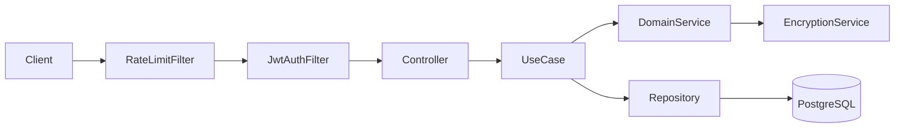
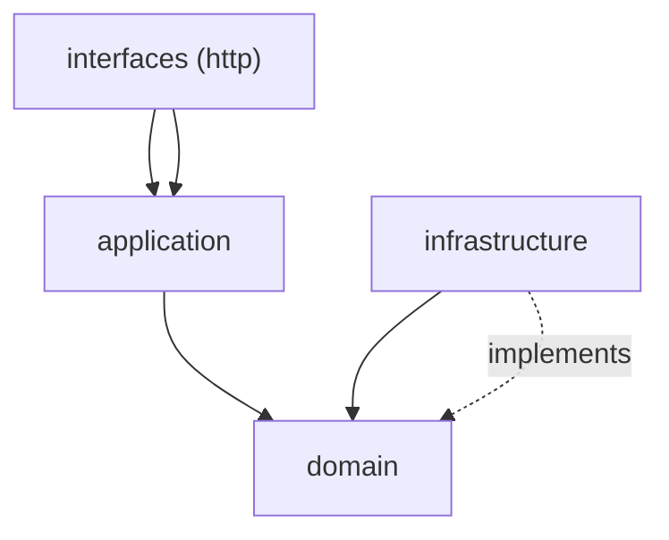
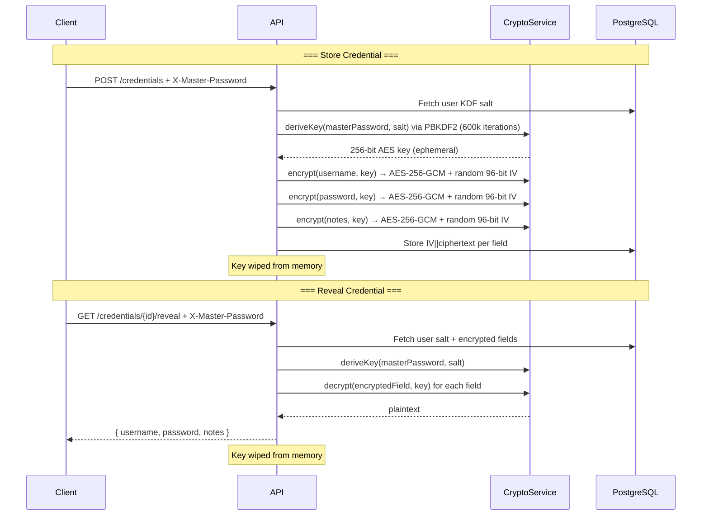

# Password Vault

[](https://github.com/ybueno16/SecureApplication/actions/workflows/ci.yml)
[](https://github.com/ybueno16/SecureApplication/actions/workflows/ci.yml)

A secure credential management vault built with **Java 21**, **Spring Boot 3.4**, following **DDD** and **Object Calisthenics** principles.

## Architecture



### Layer Dependency Flow



## Encryption / Decryption Flow



## Object Calisthenics Compliance Checklist

| # | Rule | Status | Notes |
|---|------|--------|-------|
| 1 | One level of indentation | ✅ | Stream pipelines, guard clauses, early returns |
| 2 | No ELSE keyword | ✅ | Guard clauses + `Optional` throughout domain/application |
| 3 | Wrap all primitives and strings | ✅ | 15+ Value Objects (UserId, Email, PasswordHash, etc.) |
| 4 | First-class collections | ✅ | `Tags` class with domain behavior |
| 5 | One dot per line | ✅ | Delegation methods on entities (e.g., `credential.encryptedPassword()`) |
| 6 | Don't abbreviate | ✅ | Full names: `CredentialRepository`, `FailedLoginAttempts`, etc. |
| 7 | Keep entities small | ✅ | Domain ≤100 lines, Application ≤150 lines |
| 8 | Max 2 instance variables | ✅ | Composed VOs; documented exceptions for 3-field VOs |
| 9 | No getters/setters | ✅ | Behavior methods + `to*()` accessors for persistence (OC-9 documented) |

**Relaxations** (infrastructure/interfaces only, marked with `// OC-relaxed`):
- Spring Security DSL method chaining
- Controller constructors with multiple use case dependencies
- JDBC RowMapper inner classes

## Tech Stack

| Layer | Technology |
|-------|-----------|
| Build | Gradle (Kotlin DSL) |
| Framework | Spring Boot 3.4 + Spring Security 6 |
| Database | PostgreSQL 16 + NamedParameterJdbcTemplate (zero JPA) |
| Migrations | Flyway |
| Validation | Jakarta Validation 3 |
| Docs | Springdoc OpenAPI 2 |
| Auth | JWT RS256 (JJWT) + Argon2id |
| Encryption | AES-256-GCM + PBKDF2-HMAC-SHA256 |
| Rate Limiting | Bucket4j + Caffeine |
| Testing | JUnit 5 + Mockito + Testcontainers |

## Setup & Run

### Prerequisites
- Java 21+
- Docker & Docker Compose

### With Docker Compose
```bash
docker compose up -d
```
App available at `http://localhost:8080`
Swagger UI at `http://localhost:8080/swagger-ui.html`

### Local Development
```bash
# Start PostgreSQL
docker compose up -d postgres

# Run the app
./gradlew bootRun --args='--spring.profiles.active=dev'
```

### Run Tests
```bash
# Unit tests only
./gradlew test --tests "com.vault.domain.*" --tests "com.vault.application.*"

# Integration tests (embedded PostgreSQL — no Docker required)
./gradlew test --tests "com.vault.integration.*"

# All tests with coverage report
./gradlew test jacocoTestReport
# Report: build/reports/jacoco/test/html/index.html
```

## API Endpoints

| Method | Path | Auth | Description |
|--------|------|------|-------------|
| `POST` | `/api/v1/auth/register` | No | Register a new user |
| `POST` | `/api/v1/auth/login` | No | Login → access token + refresh token |
| `POST` | `/api/v1/auth/refresh` | No | Refresh token pair |
| `POST` | `/api/v1/auth/logout` | Bearer | Revoke all refresh tokens |
| `POST` | `/api/v1/credentials` | Bearer + `X-Master-Password` | Create encrypted credential |
| `GET` | `/api/v1/credentials` | Bearer | List credentials (cursor pagination) |
| `PUT` | `/api/v1/credentials/{id}` | Bearer + `X-Master-Password` | Update credential |
| `DELETE` | `/api/v1/credentials/{id}` | Bearer | Delete credential |
| `GET` | `/api/v1/credentials/{id}/reveal` | Bearer + `X-Master-Password` | Decrypt & reveal credential |
| `GET` | `/api/v1/generator` | No | Generate random secure password |

### Query Parameters for `/api/v1/generator`

| Param | Type | Default | Description |
|-------|------|---------|-------------|
| `length` | int | 24 | Password length (8–128) |
| `symbols` | bool | true | Include symbols |
| `ambiguous` | bool | false | Exclude ambiguous chars (O0Il1) |

### Query Parameters for `/api/v1/credentials`

| Param | Type | Default | Description |
|-------|------|---------|-------------|
| `search` | string | — | Filter by site URL (ILIKE) |
| `cursor` | string | — | Pagination cursor |
| `limit` | int | 20 | Page size (max 100) |

## Security Features

- **JWT RS256** — RSA 2048-bit key pair generated on first startup
- **Argon2id** — Password hashing (memory=64MB, iterations=3, parallelism=1)
- **AES-256-GCM** — Credential encryption with unique IV per field
- **PBKDF2-HMAC-SHA256** — Key derivation (600,000 iterations, per-user salt)
- **Rate limiting** — 5 req/min per IP + 10 req/hour per username on login
- **Account lock** — 10 consecutive failures → 15 min lockout
- **HSTS + CSP** — Security headers via Spring Security
- **Async audit log** — All sensitive operations logged
- **No sensitive data in logs** — Password fields masked

---

## Decisões Técnicas

### Arquitetura

O projeto segue **Domain-Driven Design (DDD)** com quatro camadas bem definidas:

| Camada | Pacote | Responsabilidade |
|--------|--------|------------------|
| **Domain** | `com.vault.domain` | Entidades, Value Objects, lógica de negócio pura, interfaces de repositório |
| **Application** | `com.vault.application` | Casos de uso, orquestração de fluxos, DTOs |
| **Infrastructure** | `com.vault.infrastructure` | Implementação de repositórios (JDBC), serviços de segurança, config Spring |
| **Interfaces** | `com.vault.interfaces` | Controllers HTTP, filtros de requisição |

A regra de dependência flui para dentro: camadas externas dependem das internas, nunca o contrário. A infraestrutura implementa as interfaces definidas no domínio (inversão de dependência).

### Object Calisthenics

Todas as **9 regras** do Object Calisthenics são respeitadas no domínio e na camada de aplicação:

- **Value Objects** para todo primitivo (`UserId`, `Email`, `PasswordHash`, `EncryptedField`, `Tags`, etc.) — elimina primitive obsession
- **Sem getters/setters** — objetos expõem comportamento, não estado
- **Sem `else`** — guard clauses e `Optional` em todo o domínio
- **Coleções de primeira classe** — `Tags` encapsula `List<String>` com regras
- **Entidades pequenas** — domínio ≤ 100 linhas, casos de uso ≤ 150 linhas

Relaxamentos documentados apenas em infraestrutura/interfaces (DSL do Spring Security, RowMappers).

### Tecnologias e Justificativas

**Zero JPA / Hibernate** — Num projeto de cofre de senhas, cada query precisa ser intencional e auditável. JPA esconde o SQL, e em segurança isso é um problema — você precisa saber exatamente o que está sendo executado e quando. O `NamedParameterJdbcTemplate` mantém o controle explícito sem abrir mão da produtividade.

**JWT RS256 com par de chaves gerado em startup** — Escolhi criptografia assimétrica em vez de HMAC justamente para não precisar distribuir um segredo compartilhado entre instâncias. A chave privada assina e nunca sai do processo; qualquer réplica consegue validar tokens usando só a pública.

**Argon2id para senhas** — É o algoritmo vencedor do Password Hashing Competition e hoje o mais recomendado para armazenar senhas. Ele é propositalmente lento e consome memória para tornar ataques de força bruta caros — tanto em GPU quanto em hardware especializado.

**AES-256-GCM + PBKDF2-HMAC-SHA256** — GCM autentica o dado além de cifrá-lo, então qualquer adulteração no banco é detectada na hora do decrypt. Um IV aleatório de 96 bits por campo garante que a mesma senha apareça diferente no banco toda vez. O PBKDF2 deriva a chave a partir da master password do usuário com 600k iterações — a senha nunca é armazenada, só a chave derivada é usada em memória e depois descartada.

**Bucket4j + Caffeine** — Rate limiting em memória, sem Redis, sem banco, sem infra extra. O Caffeine cuida da expiração automática dos buckets, mantendo tudo simples e suficiente para o escopo do projeto.

**Flyway** — O schema do banco mora junto com o código no repositório. Qualquer mudança passa por revisão, tem histórico e é reproduzível em qualquer ambiente — dev, CI ou produção.

**Embedded PostgreSQL nos testes** — Queria testes de integração reais contra PostgreSQL, mas sem obrigar ninguém a ter Docker rodando. O `embedded-postgres` sobe binários nativos do Postgres direto no processo Java, então os testes funcionam em qualquer máquina e no CI sem configuração adicional.

### Padrões SOLID Aplicados

- **SRP** — Cada use case (`RegisterUserUseCase`, `LoginUseCase`, etc.) tem uma única razão para mudar
- **OCP** — Novos algoritmos de criptografia implementam `EncryptionService` sem alterar código existente
- **LSP** — Value Objects imutáveis; substituição segura em todo contexto
- **ISP** — Interfaces de repositório segregadas por agregado (`UserRepository`, `CredentialRepository`)
- **DIP** — Domínio define interfaces; infraestrutura as implementa (nunca o contrário)