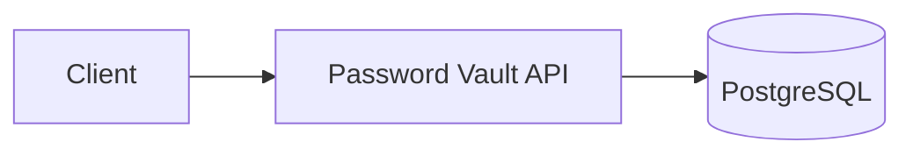
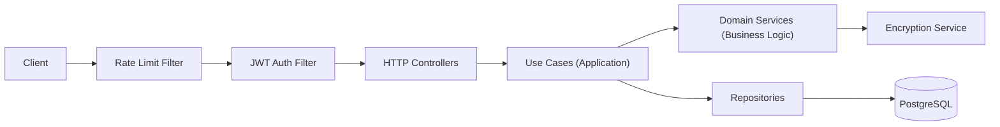
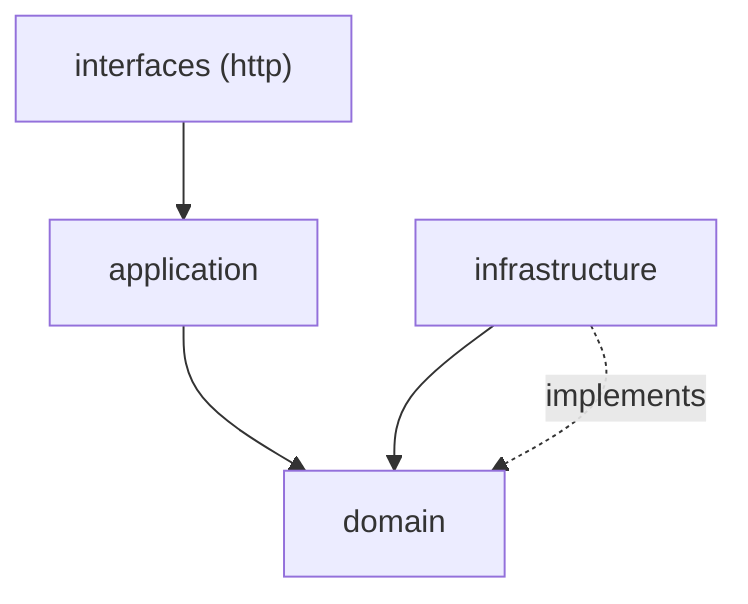
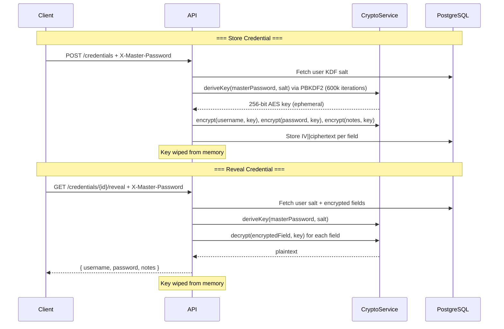

# Password Vault

[](https://github.com/ybueno16/SecureApplication/actions/workflows/ci.yml)
[](https://github.com/ybueno16/SecureApplication/actions/workflows/ci.yml)

A secure credential management vault built with **Java 21**, **Spring Boot 3.4**, following **DDD** and **Object Calisthenics** principles.

---

## What is a Password Vault?

A Password Vault is a secure system for storing, organizing, and retrieving secrets (passwords, API keys, notes, etc.) using strong encryption.  
It provides safe programmatic access (API first) for identity management, automation, and integration scenarios.

Main features:
- Store secrets protected by per-user master secrets + server-side encryption
- Retrieve and decrypt secrets on demand (never stored in plain text)
- Prevents brute-force and unauthorized access with rate limiting, JWT, Argon2id, and strict logs

---

## When Should I Use This Vault?

- You want to *store passwords/secrets/server logins* centrally and decrypt only when needed.
- You need an API-driven backend for building your own password manager, DevOps secrets tool, or strongbox for scripts and automations.
- Your team handles credentials for production, staging, cloud, and you want security/auditability.

---

## How to Use — Quick Guide

> See [API Endpoints](#api-endpoints) for details.

1. **Register (Create your user)**
    ```bash
    curl -X POST http://localhost:8080/api/v1/auth/register \
         -H "Content-Type: application/json" \
         -d '{"email":"you@example.com","password":"MyStr0ngPass"}'
    ```

2. **Login (Get Token)**
    ```bash
    curl -X POST http://localhost:8080/api/v1/auth/login \
         -H "Content-Type: application/json" \
         -d '{"email":"you@example.com","password":"MyStr0ngPass"}'
    ```
    Save the `accessToken`!

3. **Store a Secret**
    ```bash
    curl -X POST http://localhost:8080/api/v1/credentials \
         -H "Authorization: Bearer <ACCESS_TOKEN>" \
         -H "X-Master-Password: <YOUR_MASTER_PASS>" \
         -H "Content-Type: application/json" \
         -d '{"site":"github.com","username":"youruser","password":"Y0urS3cr3t"}'
    ```

4. **List Credentials**
    ```bash
    curl -X GET http://localhost:8080/api/v1/credentials \
         -H "Authorization: Bearer <ACCESS_TOKEN>"
    ```

5. **Reveal/Decrypt a Secret**
    ```bash
    curl -X GET http://localhost:8080/api/v1/credentials/<CRED_ID>/reveal \
         -H "Authorization: Bearer <ACCESS_TOKEN>" \
         -H "X-Master-Password: <YOUR_MASTER_PASS>"
    ```

6. **Generate a Random Password**
    ```bash
    curl -X GET "http://localhost:8080/api/v1/generator?length=20"
    ```

7. **Update / Delete Credentials**
    See examples in [API Endpoints](#api-endpoints).

---

## FAQ

**Why do I need the master password each time?**  
Your secrets are "zero knowledge": only your password can decrypt them. The server never stores your master password.

**Is this audited and secure?**  
All encryption is with AES-256-GCM, PBKDF2 (600k), Argon2id for login, and JWT for sessions. Logs, rate limits, and rules minimize attack surface.

---

## Setup & Run

### Prerequisites
- Java 21+
- Docker & Docker Compose

### With Docker Compose
```bash
docker compose up -d
```
App available at `http://localhost:8080`  
Swagger UI at `http://localhost:8080/swagger-ui.html`

### Local Development
```bash
# Start PostgreSQL
docker compose up -d postgres

# Run the app
./gradlew bootRun --args='--spring.profiles.active=dev'
```

### Run Tests
```bash
# Unit tests only
./gradlew test --tests "com.vault.domain.*" --tests "com.vault.application.*"

# Integration tests (embedded PostgreSQL — no Docker required)
./gradlew test --tests "com.vault.integration.*"

# All tests with coverage report
./gradlew test jacocoTestReport
# Report: build/reports/jacoco/test/html/index.html
```

---

## Architecture

### System Context (High-Level)


- **Client**: Your app, CLI tools, or web UI
- **Password Vault API**: Handles authentication, encryption, secrets storage
- **PostgreSQL**: Securely stores encrypted credentials and user data

### Components and Flow



### Layer Dependency (DDD)



---

## Encryption / Decryption Flow



---

## Object Calisthenics Compliance Checklist

| # | Rule | Status | Notes |
|---|------|--------|-------|
| 1 | One level of indentation | ✅ | Stream pipelines, guard clauses, early returns |
| 2 | No ELSE keyword | ✅ | Guard clauses + `Optional` throughout domain/application |
| 3 | Wrap all primitives and strings | ✅ | 15+ Value Objects (UserId, Email, PasswordHash, etc.) |
| 4 | First-class collections | ✅ | `Tags` class with domain behavior |
| 5 | One dot per line | ✅ | Delegation methods on entities (e.g., `credential.encryptedPassword()`) |
| 6 | Don't abbreviate | ✅ | Full names: `CredentialRepository`, `FailedLoginAttempts`, etc. |
| 7 | Keep entities small | ✅ | Domain ≤100 lines, Application ≤150 lines |
| 8 | Max 2 instance variables | ✅ | Composed VOs; documented exceptions for 3-field VOs |
| 9 | No getters/setters | ✅ | Behavior methods + `to*()` accessors for persistence (OC-9 documented) |

**Relaxations** (infrastructure/interfaces only, marked with `// OC-relaxed`):
- Spring Security DSL method chaining
- Controller constructors with multiple use case dependencies
- JDBC RowMapper inner classes

---

## Tech Stack

| Layer | Technology |
|-------|-----------|
| Build | Gradle (Kotlin DSL) |
| Framework | Spring Boot 3.4 + Spring Security 6 |
| Database | PostgreSQL 16 + NamedParameterJdbcTemplate (zero JPA) |
| Migrations | Flyway |
| Validation | Jakarta Validation 3 |
| Docs | Springdoc OpenAPI 2 |
| Auth | JWT RS256 (JJWT) + Argon2id |
| Encryption | AES-256-GCM + PBKDF2-HMAC-SHA256 |
| Rate Limiting | Bucket4j + Caffeine |
| Testing | JUnit 5 + Mockito + Testcontainers |

---

## API Endpoints

| Method | Path | Auth | Description |
|--------|------|------|-------------|
| `POST` | `/api/v1/auth/register` | No | Register a new user |
| `POST` | `/api/v1/auth/login` | No | Login → access token + refresh token |
| `POST` | `/api/v1/auth/refresh` | No | Refresh token pair |
| `POST` | `/api/v1/auth/logout` | Bearer | Revoke all refresh tokens |
| `POST` | `/api/v1/credentials` | Bearer + `X-Master-Password` | Create encrypted credential |
| `GET` | `/api/v1/credentials` | Bearer | List credentials (cursor pagination) |
| `PUT` | `/api/v1/credentials/{id}` | Bearer + `X-Master-Password` | Update credential |
| `DELETE` | `/api/v1/credentials/{id}` | Bearer | Delete credential |
| `GET` | `/api/v1/credentials/{id}/reveal` | Bearer + `X-Master-Password` | Decrypt & reveal credential |
| `GET` | `/api/v1/generator` | No | Generate random secure password |

---

## Security Features

- **JWT RS256** — RSA 2048-bit key pair generated on first startup
- **Argon2id** — Password hashing (memory=64MB, iterations=3, parallelism=1)
- **AES-256-GCM** — Credential encryption with unique IV per field
- **PBKDF2-HMAC-SHA256** — Key derivation (600,000 iterations, per-user salt)
- **Rate limiting** — 5 req/min per IP + 10 req/hour per username on login
- **Account lock** — 10 consecutive failures → 15 min lockout
- **HSTS + CSP** — Security headers via Spring Security
- **Async audit log** — All sensitive operations logged
- **No sensitive data in logs** — Password fields masked

---

## Technical Decisions

### Architecture

This project follows **Domain-Driven Design (DDD)** with four well-defined layers:

| Layer | Package | Responsibility |
|------|---------|----------------|
| **Domain** | `com.vault.domain` | Entities, Value Objects, pure business rules, repository interfaces |
| **Application** | `com.vault.application` | Use cases, flow orchestration, DTOs |
| **Infrastructure** | `com.vault.infrastructure` | Repository implementations (JDBC), security services, Spring configuration |
| **Interfaces** | `com.vault.interfaces` | HTTP controllers, request filters |

The dependency rule flows inward: outer layers depend on inner layers, never the opposite. Infrastructure implements interfaces defined by the domain (dependency inversion).

### Object Calisthenics

All **9 Object Calisthenics rules** are respected in the domain and application layers:

- **Value Objects** for every primitive (`UserId`, `Email`, `PasswordHash`, `EncryptedField`, `Tags`, etc.) — eliminates primitive obsession
- **No getters/setters** — objects expose behavior, not state
- **No `else`** — guard clauses and `Optional` across domain logic
- **First-class collections** — `Tags` encapsulates `List<String>` with rules
- **Small entities/use cases** — domain ≤ 100 lines, use cases ≤ 150 lines

Relaxations are documented only in infrastructure/interfaces (Spring Security DSL, RowMappers).

### Technologies and Rationale

**Zero JPA / Hibernate** — In a password vault, every query must be intentional and auditable. JPA can hide SQL and execution behavior; for security-sensitive code, you want to know exactly what runs and when. `NamedParameterJdbcTemplate` keeps control explicit without sacrificing too much productivity.

**JWT RS256 with keys generated at startup** — Asymmetric crypto avoids distributing a shared secret between instances. The private key signs and never leaves the process; any replica can validate tokens using only the public key.

**Argon2id for passwords** — A modern recommended choice for password storage. It is intentionally slow and memory-hard to make brute-force attacks expensive on GPUs and specialized hardware.

**AES-256-GCM + PBKDF2-HMAC-SHA256** — GCM authenticates ciphertext in addition to encrypting it, so tampering in the database is detected during decryption. A random 96-bit IV per field ensures the same plaintext encrypts differently every time. PBKDF2 derives an AES key from the user master password using a per-user salt and 600k iterations — the master password is never stored; only the derived key is used in memory and then discarded.

**Bucket4j + Caffeine** — In-memory rate limiting (no Redis, no database, no extra infrastructure). Caffeine handles bucket expiration automatically, keeping things simple and effective for the project scope.

**Flyway** — The database schema lives with the code. Every change is reviewed, versioned, and reproducible in dev, CI, and production.

**Embedded PostgreSQL in tests** — Integration tests should run against a real PostgreSQL engine without requiring Docker. `embedded-postgres` runs native PostgreSQL binaries inside the Java process, so tests work on developer machines and in CI with minimal setup.

### Applied SOLID Principles

- **SRP** — Each use case (`RegisterUserUseCase`, `LoginUseCase`, etc.) has a single reason to change
- **OCP** — New crypto algorithms implement `EncryptionService` without modifying existing code
- **LSP** — Immutable Value Objects; safe substitution across contexts
- **ISP** — Repository interfaces are segregated by aggregate (`UserRepository`, `CredentialRepository`)
- **DIP** — The domain defines interfaces; infrastructure implements them (never the other way around)

---

Feel free to suggest more improvements or open a PR! 🚀
